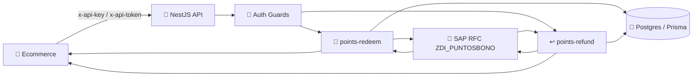
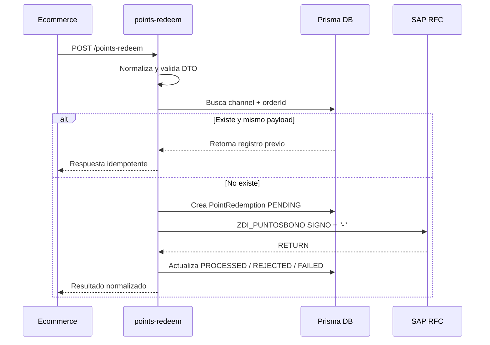
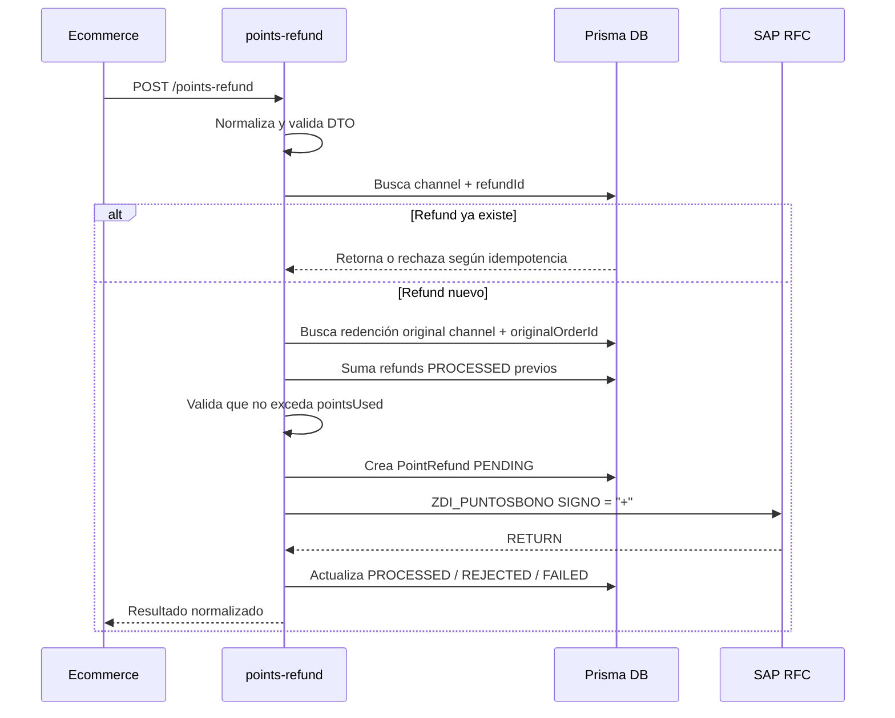
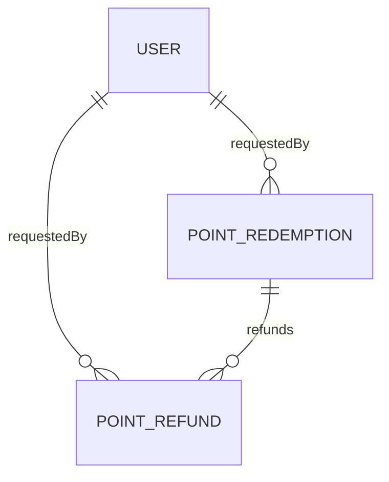

# 🎯 Points Redeem & Refund

Documentación funcional y técnica de la nueva funcionalidad para **uso** y **devolución** de puntos de bono desde ecommerce hacia SAP.

Esta feature permite que un ecommerce envíe al backend los datos de una compra donde el cliente usa puntos, o de una devolución donde esos puntos deben reintegrarse en SAP. El backend valida, protege, registra trazabilidad local, controla idempotencia y delega la operación final al servicio RFC SAP.

## 📌 Resumen Ejecutivo

La funcionalidad cubre dos procesos de negocio:

| Proceso | Endpoint | Acción SAP | Objetivo |
|---|---|---|---|
| Uso de puntos | `POST /api/v1/points-redeem` | `SIGNO = "-"` | Rebajar puntos del cliente por una compra ecommerce |
| Devolución de puntos | `POST /api/v1/points-refund` | `SIGNO = "+"` | Devolver puntos al cliente por reembolso o devolución |

Los dos flujos comparten el mismo RFC SAP base:

```text
ZDI_PUNTOSBONO
```

La diferencia operativa está en el campo `SIGNO` enviado a SAP.

## 🧭 Arquitectura General



## 🔐 Seguridad

Los endpoints están protegidos por el guard global de autenticación.

### Autenticación principal para ecommerce

El ecommerce debe enviar:

```http
x-api-key: <API_KEY>
x-api-token: <API_TOKEN>
```

Estas credenciales se validan contra la tabla local `api_credentials`.

### Autenticación alternativa

También se soporta `Bearer JWT` para usuarios administrativos.

### Roles permitidos

Ambos controladores usan:

```ts
@Roles(RoleType.API_CLIENT, RoleType.SUPER_ADMIN, RoleType.ADMIN)
```

Roles permitidos:

| Rol | Uso esperado |
|---|---|
| `API_CLIENT` | Integración ecommerce o sistema externo |
| `SUPER_ADMIN` | Pruebas y soporte administrativo |
| `ADMIN` | Pruebas y soporte operativo |

### Actor técnico vs cliente final

El `User` local **no representa al cliente dueño de los puntos**.

| Concepto | Dónde se registra |
|---|---|
| Ecommerce o integración que llama al API | `requestedByUserId`, `requestedByUser` |
| Cliente final dueño de la tarjeta/puntos | `documentNumber`, `cardNumber`, `customerName` |

## 🎯 Módulo `points-redeem`

### Objetivo

Registrar y procesar el uso de puntos de bono en una compra ecommerce.

### Ruta

```http
POST /api/v1/points-redeem
```

### Controller

Archivo:

```text
src/point-redemptions/point-redemptions.controller.ts
```

Clase:

```ts
PointRedemptionsController
```

Responsabilidades:

| Responsabilidad | Descripción |
|---|---|
| Recibir request | Usa `CreatePointRedemptionDto` |
| Capturar actor técnico | Usa `@CurrentUser('id')` para `requestedByUserId` |
| Aplicar seguridad | Usa `@Roles(...)` y auth global |
| Delegar lógica | Llama a `PointRedemptionsService.create(...)` |

### Service

Archivo:

```text
src/point-redemptions/point-redemptions.service.ts
```

Clase:

```ts
PointRedemptionsService
```

Método principal:

```ts
create(dto: CreatePointRedemptionDto, requestedByUserId?: string)
```

Flujo de negocio:



### DTO de entrada

Archivo:

```text
src/point-redemptions/dto/create-point-redemption.dto.ts
```

Clase:

```ts
CreatePointRedemptionDto
```

Campos:

| Campo | Tipo | Requerido | Regla | Descripción |
|---|---:|---:|---|---|
| `orderId` | `string` | Sí | `MaxLength(100)` | Identificador único de la orden por canal |
| `cardNumber` | `string` | Sí | `MaxLength(30)` | Número de tarjeta del cliente |
| `documentNumber` | `string` | Sí | `MaxLength(20)` | Cédula/RUC/identificación del cliente |
| `customerName` | `string` | No | `MaxLength(150)` | Nombre del cliente |
| `purchaseAmount` | `number` | Sí | `Min(0.01)`, 2 decimales | Valor total de la compra |
| `pointsUsed` | `number` | Sí | `Min(0.001)`, 3 decimales | Puntos usados en la compra |
| `currency` | `string` | No | Default `USD` | Moneda de la transacción |
| `channel` | `string` | No | Default `ECOMMERCE` | Canal que origina la operación |
| `storeCode` | `string` | No | `MaxLength(30)` | Código de tienda/canal ecommerce |
| `transactionAt` | `string` | Sí | ISO Date | Fecha/hora de la compra |
| `notes` | `string` | No | `MaxLength(500)` | Observación operativa |

### Ejemplo request

```json
{
  "orderId": "WEB-ORD-20260428-000123",
  "cardNumber": "8355100049400010",
  "documentNumber": "0917256331",
  "customerName": "JUAN PEREZ",
  "purchaseAmount": 149.99,
  "pointsUsed": 120,
  "currency": "USD",
  "channel": "ECOMMERCE",
  "storeCode": "WEB",
  "transactionAt": "2026-04-28T15:30:00Z",
  "notes": "Checkout web"
}
```

### DTO de salida

Archivo:

```text
src/point-redemptions/dto/point-redemption-response.dto.ts
```

Clase:

```ts
PointRedemptionResponseDto
```

Campos:

| Campo | Tipo | Descripción |
|---|---:|---|
| `redemptionId` | `string` | ID local de la redención |
| `orderId` | `string` | Orden ecommerce |
| `channel` | `string` | Canal de origen |
| `status` | `PointRedemptionStatus` | Estado local |
| `documentNumber` | `string` | Identificación del cliente |
| `cardNumber` | `string` | Tarjeta usada |
| `purchaseAmount` | `number` | Valor de compra |
| `pointsUsed` | `number` | Puntos usados |
| `remainingPoints` | `number \| null` | Puntos disponibles luego de SAP |
| `sapReference` | `string \| null` | Referencia SAP si aplica |
| `sapMessage` | `string \| null` | Mensaje retornado por SAP |
| `processedAt` | `string \| null` | Fecha de procesamiento exitoso |
| `message` | `string` | Mensaje normalizado |

## ↩️ Módulo `points-refund`

### Objetivo

Registrar y procesar la devolución de puntos previamente usados en una compra ecommerce.

Soporta devoluciones:

| Tipo | Soportado |
|---|---:|
| Total | Sí |
| Parcial | Sí |
| Múltiples parciales sobre la misma compra | Sí |
| Devolución mayor a puntos usados | No |

### Ruta

```http
POST /api/v1/points-refund
```

### Controller

Archivo:

```text
src/point-refunds/point-refunds.controller.ts
```

Clase:

```ts
PointRefundsController
```

Responsabilidades:

| Responsabilidad | Descripción |
|---|---|
| Recibir request | Usa `CreatePointRefundDto` |
| Capturar actor técnico | Usa `@CurrentUser('id')` para `requestedByUserId` |
| Aplicar seguridad | Usa `@Roles(...)` y auth global |
| Delegar lógica | Llama a `PointRefundsService.create(...)` |

### Service

Archivo:

```text
src/point-refunds/point-refunds.service.ts
```

Clase:

```ts
PointRefundsService
```

Método principal:

```ts
create(dto: CreatePointRefundDto, requestedByUserId?: string)
```

Flujo de negocio:



### DTO de entrada

Archivo:

```text
src/point-refunds/dto/create-point-refund.dto.ts
```

Clase:

```ts
CreatePointRefundDto
```

Campos:

| Campo | Tipo | Requerido | Regla | Descripción |
|---|---:|---:|---|---|
| `refundId` | `string` | Sí | `MaxLength(100)` | Identificador único de la devolución por canal |
| `originalOrderId` | `string` | Sí | `MaxLength(100)` | Orden original donde se usaron puntos |
| `cardNumber` | `string` | Sí | `MaxLength(30)` | Tarjeta del cliente |
| `documentNumber` | `string` | Sí | `MaxLength(20)` | Identificación del cliente |
| `customerName` | `string` | No | `MaxLength(150)` | Nombre del cliente |
| `refundAmount` | `number` | Sí | `Min(0.01)`, 2 decimales | Valor monetario devuelto |
| `pointsRefunded` | `number` | Sí | `Min(0.001)`, 3 decimales | Puntos a devolver |
| `currency` | `string` | No | Default `USD` | Moneda |
| `channel` | `string` | No | Default `ECOMMERCE` | Canal origen |
| `storeCode` | `string` | No | `MaxLength(30)` | Código de tienda/canal |
| `transactionAt` | `string` | Sí | ISO Date | Fecha/hora de devolución |
| `reason` | `string` | No | `MaxLength(200)` | Motivo de devolución |
| `notes` | `string` | No | `MaxLength(500)` | Observación operativa |

### Ejemplo request

```json
{
  "refundId": "WEB-REF-20260428-000123",
  "originalOrderId": "WEB-ORD-20260428-000123",
  "cardNumber": "8355100049400010",
  "documentNumber": "0917256331",
  "customerName": "JUAN PEREZ",
  "refundAmount": 49.99,
  "pointsRefunded": 40,
  "currency": "USD",
  "channel": "ECOMMERCE",
  "storeCode": "WEB",
  "transactionAt": "2026-04-28T18:10:00Z",
  "reason": "Customer canceled part of order",
  "notes": "Partial refund from ecommerce"
}
```

### DTO de salida

Archivo:

```text
src/point-refunds/dto/point-refund-response.dto.ts
```

Clase:

```ts
PointRefundResponseDto
```

Campos:

| Campo | Tipo | Descripción |
|---|---:|---|
| `refundRecordId` | `string` | ID local de la devolución |
| `refundId` | `string` | ID ecommerce de devolución |
| `originalOrderId` | `string` | Orden original |
| `channel` | `string` | Canal de origen |
| `status` | `PointRefundStatus` | Estado local |
| `documentNumber` | `string` | Identificación del cliente |
| `cardNumber` | `string` | Tarjeta asociada |
| `refundAmount` | `number` | Valor monetario devuelto |
| `pointsRefunded` | `number` | Puntos devueltos |
| `remainingPoints` | `number \| null` | Puntos disponibles luego de SAP |
| `sapReference` | `string \| null` | Referencia SAP si aplica |
| `sapMessage` | `string \| null` | Mensaje SAP |
| `processedAt` | `string \| null` | Fecha de procesamiento exitoso |
| `message` | `string` | Mensaje normalizado |

## 🏢 Integración SAP

### Servicio involucrado

Archivo:

```text
src/sap/sap.service.ts
```

Métodos públicos involucrados:

```ts
redeemPoints(input: SapPointRedemptionRequestDto, operator: string)
refundPoints(input: SapPointRefundRequestDto, operator: string)
```

Ambos métodos llaman a un helper común:

```ts
zdiPuntosBono(cardNumber: string, pointsUsedOrRefunded: number, operator: string)
```

### RFC SAP

```text
ZDI_PUNTOSBONO
```

### Parámetros enviados a SAP

| Parámetro SAP | Origen | Ejemplo | Descripción |
|---|---|---|---|
| `NUNTR` | `cardNumber` | `8355100049400010` | Número de tarjeta |
| `ESTAB` | Constante | `7100038994` | Establecimiento configurado |
| `REFTR` | `getDateYYMMDD()` | `260429` | Fecha en formato `YYMMDD` |
| `LOTTR` | `generateRandom6DigitsString()` | `123456` | Lote aleatorio de 6 dígitos |
| `IMPPB` | Puntos | `120` | Puntos usados o devueltos |
| `SIGNO` | Operación | `-` o `+` | `-` rebaja, `+` devolución |

### Operadores SAP

| Flujo | Método service | Operador |
|---|---|---:|
| Uso de puntos | `sapService.redeemPoints(sapRequest, "-")` | `-` |
| Devolución de puntos | `sapService.refundPoints(sapRequest, "+")` | `+` |

### Interpretación de respuesta SAP

El resultado SAP se interpreta con el campo:

```ts
result.RETURN
```

Regla:

| Condición | Resultado |
|---|---|
| `RETURN` inicia con `"00"` | Operación exitosa |
| Cualquier otro valor | Rechazo funcional SAP |

Después de la llamada, el backend consulta nuevamente al cliente con:

```ts
getCustomerById(documentNumber)
```

Esto permite devolver `remainingPoints` actualizado desde SAP.

## 🧾 Modelos Prisma

### Enums

```prisma
enum PointRedemptionStatus {
  PENDING
  PROCESSED
  REJECTED
  FAILED
}

enum PointRefundStatus {
  PENDING
  PROCESSED
  REJECTED
  FAILED
}
```

### Modelo `PointRedemption`

Tabla:

```text
point_redemptions
```

Propósito:

Registrar cada intento de uso de puntos enviado por ecommerce.

Campos principales:

| Campo | Tipo | Propósito |
|---|---|---|
| `orderId` | `String` | Idempotencia de compra |
| `channel` | `String` | Canal ecommerce |
| `documentNumber` | `String` | Cliente final |
| `cardNumber` | `String` | Tarjeta usada |
| `purchaseAmount` | `Decimal(15,2)` | Valor compra |
| `pointsUsed` | `Decimal(15,3)` | Puntos rebajados |
| `status` | `PointRedemptionStatus` | Estado local |
| `requestPayload` | `Json` | Request normalizado |
| `sapRequestPayload` | `Json?` | Payload enviado a SAP |
| `sapResponsePayload` | `Json?` | Respuesta SAP |
| `requestedByUserId` | `String?` | Usuario técnico/integración |

Índices y constraints:

```prisma
@@unique([channel, orderId])
@@index([status])
@@index([transactionAt])
@@index([documentNumber])
@@index([cardNumber])
@@index([requestedByUserId])
```

### Modelo `PointRefund`

Tabla:

```text
point_refunds
```

Propósito:

Registrar devoluciones totales o parciales de puntos asociadas a una redención original.

Campos principales:

| Campo | Tipo | Propósito |
|---|---|---|
| `refundId` | `String` | Idempotencia de devolución |
| `originalOrderId` | `String` | Orden original de la compra |
| `pointRedemptionId` | `String` | Relación con redención original |
| `documentNumber` | `String` | Cliente final |
| `cardNumber` | `String` | Tarjeta asociada |
| `refundAmount` | `Decimal(15,2)` | Valor devuelto |
| `pointsRefunded` | `Decimal(15,3)` | Puntos a devolver |
| `status` | `PointRefundStatus` | Estado local |
| `requestPayload` | `Json` | Request normalizado |
| `sapRequestPayload` | `Json?` | Payload enviado a SAP |
| `sapResponsePayload` | `Json?` | Respuesta SAP |
| `requestedByUserId` | `String?` | Usuario técnico/integración |

Índices y constraints:

```prisma
@@unique([channel, refundId])
@@index([originalOrderId])
@@index([pointRedemptionId])
@@index([status])
@@index([transactionAt])
@@index([documentNumber])
@@index([cardNumber])
@@index([requestedByUserId])
```

### Relaciones



## 🔁 Idempotencia

### Uso de puntos

Clave única:

```text
channel + orderId
```

Reglas:

| Caso | Resultado |
|---|---|
| Mismo `channel + orderId` y mismo payload con `PROCESSED` | Devuelve respuesta previa |
| Mismo `channel + orderId` y payload diferente | `409 Conflict` |
| Mismo `channel + orderId` con `PENDING` | `409 Conflict` |
| Mismo `channel + orderId` con `FAILED` | `409 Conflict` |

### Devolución de puntos

Clave única:

```text
channel + refundId
```

Reglas:

| Caso | Resultado |
|---|---|
| Mismo `channel + refundId` y mismo payload con `PROCESSED` | Devuelve respuesta previa |
| Mismo `channel + refundId` y payload diferente | `409 Conflict` |
| Refund acumulado excede `pointsUsed` original | `409 Conflict` |
| Redención original no existe | `404 Not Found` |
| Redención original no está `PROCESSED` | `409 Conflict` |

## 🧪 Ejemplos `curl`

### Uso de puntos

```bash
curl -X POST "http://localhost:3000/api/v1/points-redeem" \
  -H "Content-Type: application/json" \
  -H "x-api-key: TU_API_KEY" \
  -H "x-api-token: TU_API_TOKEN" \
  -d '{
    "orderId": "WEB-ORD-20260428-000123",
    "cardNumber": "8355100049400010",
    "documentNumber": "0917256331",
    "customerName": "JUAN PEREZ",
    "purchaseAmount": 149.99,
    "pointsUsed": 120,
    "currency": "USD",
    "channel": "ECOMMERCE",
    "storeCode": "WEB",
    "transactionAt": "2026-04-28T15:30:00Z",
    "notes": "Checkout web"
  }'
```

### Devolución parcial

```bash
curl -X POST "http://localhost:3000/api/v1/points-refund" \
  -H "Content-Type: application/json" \
  -H "x-api-key: TU_API_KEY" \
  -H "x-api-token: TU_API_TOKEN" \
  -d '{
    "refundId": "WEB-REF-20260428-000123",
    "originalOrderId": "WEB-ORD-20260428-000123",
    "cardNumber": "8355100049400010",
    "documentNumber": "0917256331",
    "customerName": "JUAN PEREZ",
    "refundAmount": 49.99,
    "pointsRefunded": 40,
    "currency": "USD",
    "channel": "ECOMMERCE",
    "storeCode": "WEB",
    "transactionAt": "2026-04-28T18:10:00Z",
    "reason": "Customer canceled part of order",
    "notes": "Partial refund from ecommerce"
  }'
```

## ✅ Respuestas esperadas

Todas las respuestas exitosas son envueltas por `TransformInterceptor`:

```json
{
  "statusCode": 200,
  "message": "Success",
  "data": {},
  "timestamp": "2026-04-29T16:08:20.000Z"
}
```

### Respuesta de uso de puntos

```json
{
  "statusCode": 200,
  "message": "Success",
  "data": {
    "redemptionId": "uuid",
    "orderId": "WEB-ORD-20260428-000123",
    "channel": "ECOMMERCE",
    "status": "PROCESSED",
    "documentNumber": "0917256331",
    "cardNumber": "8355100049400010",
    "purchaseAmount": 149.99,
    "pointsUsed": 120,
    "remainingPoints": 880,
    "sapReference": null,
    "sapMessage": "00 Operacion exitosa",
    "processedAt": "2026-04-28T15:30:05.000Z",
    "message": "00 Operacion exitosa"
  },
  "timestamp": "2026-04-28T15:30:05.000Z"
}
```

### Respuesta de devolución de puntos

```json
{
  "statusCode": 200,
  "message": "Success",
  "data": {
    "refundRecordId": "uuid",
    "refundId": "WEB-REF-20260428-000123",
    "originalOrderId": "WEB-ORD-20260428-000123",
    "channel": "ECOMMERCE",
    "status": "PROCESSED",
    "documentNumber": "0917256331",
    "cardNumber": "8355100049400010",
    "refundAmount": 49.99,
    "pointsRefunded": 40,
    "remainingPoints": 920,
    "sapReference": null,
    "sapMessage": "00 Operacion exitosa",
    "processedAt": "2026-04-28T18:10:04.000Z",
    "message": "00 Operacion exitosa"
  },
  "timestamp": "2026-04-28T18:10:04.000Z"
}
```

## 🚨 Errores comunes

| Código | Causa probable | Solución |
|---:|---|---|
| `400` | DTO inválido | Revisar campos requeridos y tipos |
| `401` | `x-api-key`/`x-api-token` inválidos o `API_AUTH_ENABLED=false` | Validar credenciales y `.env` |
| `403` | Usuario técnico sin rol permitido | Usar usuario `API_CLIENT`, `ADMIN` o `SUPER_ADMIN` |
| `404` | No existe redención original para refund | Verificar `originalOrderId` y `channel` |
| `409` | Duplicado o refund excede puntos usados | Revisar idempotencia y montos acumulados |
| `502` | Error RFC SAP | Revisar disponibilidad SAP y parámetros RFC |

## 🛠️ Checklist para nuevos desarrolladores

### 1. Habilitar auth API

En `.env`:

```env
API_AUTH_ENABLED=true
```

### 2. Crear usuario técnico

```bash
SEED_USER_EMAIL=info@unitystores.com \
SEED_USER_USERNAME=unitystores \
SEED_USER_PASSWORD='Un1tySt0r3s123!' \
SEED_USER_ROLE=API_CLIENT \
npm run prisma:seed:user
```

### 3. Crear credenciales API

```bash
SEED_API_CREDENTIAL_USER=unitystores \
SEED_API_CREDENTIAL_NAME='VTEX Integration' \
npm run prisma:seed:api-credential
```

Guardar los valores impresos:

```text
apiKey=...
apiToken=...
```

### 4. Verificar Prisma

```bash
npm run prisma:generate
npx prisma db push
```

### 5. Compilar

```bash
npm run build
```

### 6. Probar en Swagger

Swagger está en:

```text
http://localhost:${PORT}/${API_PREFIX}/docs
```

Por defecto:

```text
http://localhost:3000/api/v1/docs
```

## 📂 Archivos principales

| Archivo | Responsabilidad |
|---|---|
| `src/point-redemptions/point-redemptions.controller.ts` | Endpoint de uso de puntos |
| `src/point-redemptions/point-redemptions.service.ts` | Lógica de redención, idempotencia y persistencia |
| `src/point-redemptions/dto/create-point-redemption.dto.ts` | Request DTO uso de puntos |
| `src/point-redemptions/dto/point-redemption-response.dto.ts` | Response DTO uso de puntos |
| `src/point-refunds/point-refunds.controller.ts` | Endpoint de devolución de puntos |
| `src/point-refunds/point-refunds.service.ts` | Lógica de refund, parciales e idempotencia |
| `src/point-refunds/dto/create-point-refund.dto.ts` | Request DTO devolución |
| `src/point-refunds/dto/point-refund-response.dto.ts` | Response DTO devolución |
| `src/sap/sap.service.ts` | RFC `ZDI_PUNTOSBONO` y consulta de puntos remanentes |
| `prisma/schema.prisma` | Modelos `PointRedemption` y `PointRefund` |

## 🏁 Conclusión

La implementación deja una base robusta para operar puntos de bono desde ecommerce con:

| Capacidad | Estado |
|---|---:|
| Seguridad por API credentials | ✅ |
| Idempotencia de compras | ✅ |
| Idempotencia de devoluciones | ✅ |
| Devoluciones parciales | ✅ |
| Trazabilidad local completa | ✅ |
| Integración SAP RFC `ZDI_PUNTOSBONO` | ✅ |
| Auditoría por usuario técnico | ✅ |

Esta documentación debe actualizarse si SAP cambia la firma de `ZDI_PUNTOSBONO`, los códigos de `RETURN` o los parámetros requeridos para la operación.
